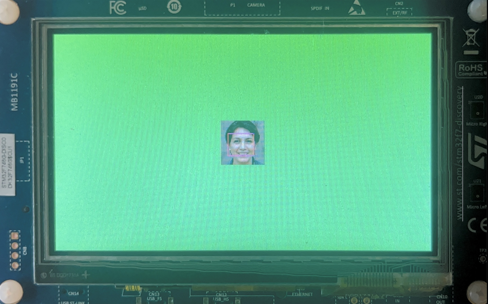
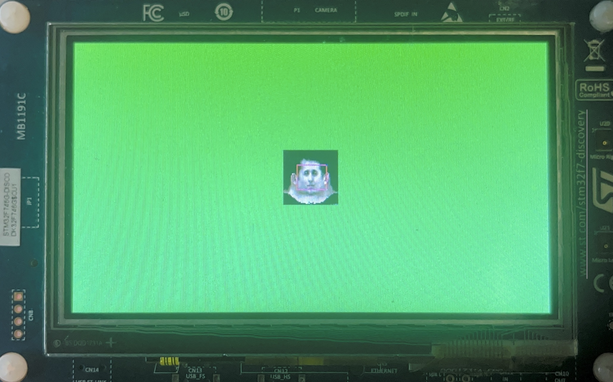
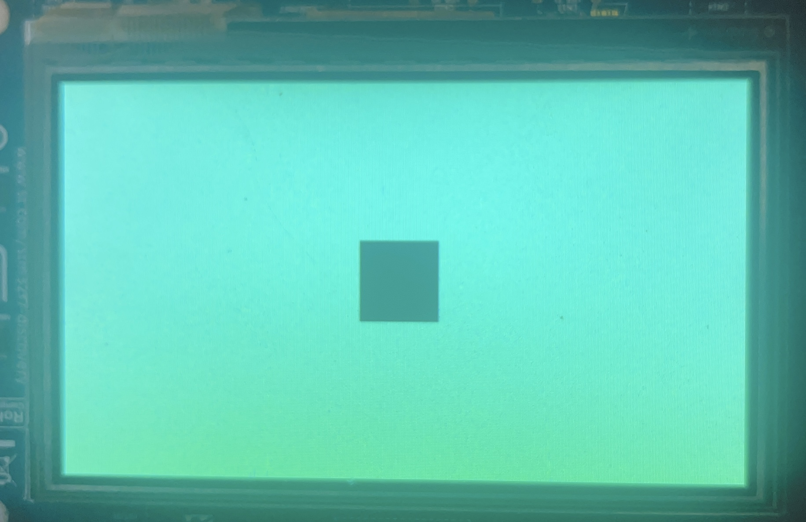

# ARM (CORTEX-M)  YOLO Demo


## Project Introduction
This project is to demonstrate the transplantation of `YOLO` neural network model to the microcontroller. MCU used is `STM32F746NGH6U` chip is `ARM CORTEX - M7` series.

## Effect Demonstration
The following is a real machine demonstration (`STM32F746G_DISCO`)

(demo1)

<p align="left">
  
</p>

(demo2)

<p align="left">
  
</p>

At the same time, the lower computer will also output the coordinates of the box, which are respectively x1, y1 (upper left corner), x2, y2 (lower left corner)
```bash
LOG: 11, 11, 44, 42
```

## Build Project
### Build Firmware
Install cross compiler and builder
```bash
sudo apt install make gcc-arm-none-eabi
```
compile
```bash
make
```
After compilation, the build directory will be generated in the current directory, and the `arm-none-eabi-objcopy` tool will be used to convert elf into `hex` and `bin` files
```bash
&:ls *.hex *.bin *.elf
stm32f746g_disco.hex
bstm32f746g_disco.bin
stm32f746g_disco.elf
```
For convenience, I provide the configuration file of openocd in the directory, of course, only for `STM32F74G_DISCO`
The configuration and use of openocd are ported to `zephyr rtos`
```bash
./openocd/bin/openocd \
-s openocd/boards/arm/stm32f746g_disco/support \
-s openocd/sysroots/x86_64-pokysdk-linux/usr/share/openocd/scripts \
-f openocd/boards/arm/stm32f746g_disco/support/openocd.cfg \
'-c init' \
'-c targets' \
-c 'reset halt' \
-c 'flash write_image erase ./build/stm32f746g_disco.hex' \
-c 'reset halt' \
-c 'verify_image ./build/stm32f746g_disco.hex' \
-c 'reset run' \
-c shutdown
```
if the burning is successful, you should see the following picture:
<p align="left">
  
</p>

### Build Applications
The application supports Windows and Linux. If you need to install `opencv` under ubnutu:
```bash
sudo apt install libopencv-video-dev
```
There is no need to install under `Windows`. I have transplanted the `opencv` library on `Windows` in lib and configured it in cmake

Because the opencv source code is large, I haven't uploaded it to the warehouse, so I need to make some simple configurations

You can download opencv here:

[download opencv](https://github.com/beiszhihao/micro-yolo/releases/download/upper_lib/upper_lib.zip)

After downloading, unzip the compressed file to the `upper file directory`

compile
```bash
&: mkdir build & cd build
&: cmake .. & cmake --build .
-- Selecting Windows SDK version 10.0.19041.0 to target Windows 10.0.22000.
-- Configuring done
-- Generating done
-- Build files have been written to: upper/build
Microsoft (R) Build Engine version 16.11.2+f32259642 for .NET Framework
Copyright (C) Microsoft Corporation. All rights reserved.

  upper.vcxproj -> upper\bin\Debug\upper.exe
```
After compilation, the executable program will be generated in the source code `bin` directory

## Usage
Let firmware do AI prediction through application:
```bash
upper -i face1.jpg -w 56 -h 56 -f rgb565 -d /dev/ttyACM0 -b 115200
```
Of course, you can also use the camera to predict AI
```bash
upper -i 0 -w 56 -h 56 -f rgb 565 -d /dev/ttyACM0 -b 115200
```
If you want to check how many cameras are on the current computer, you can use `-s` to check
```bash
upper -s
```
